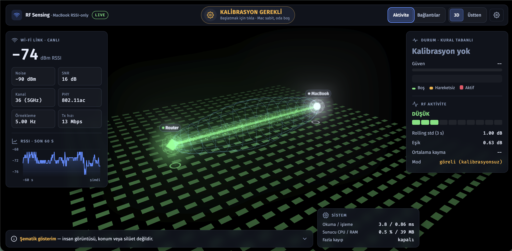
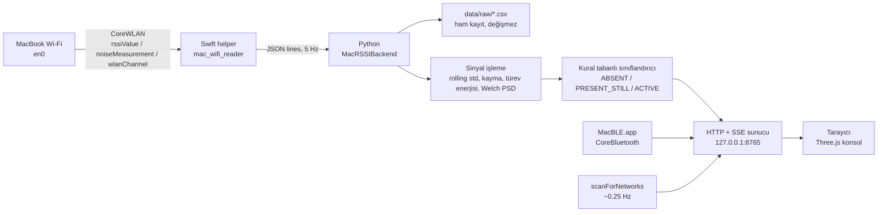
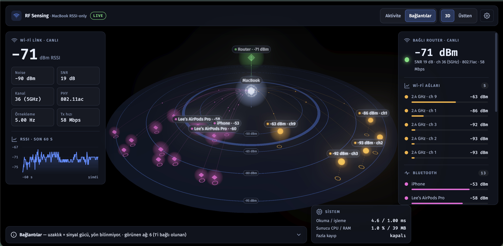
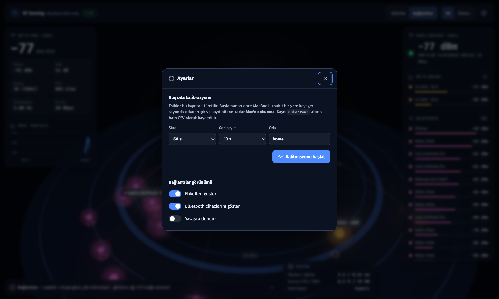
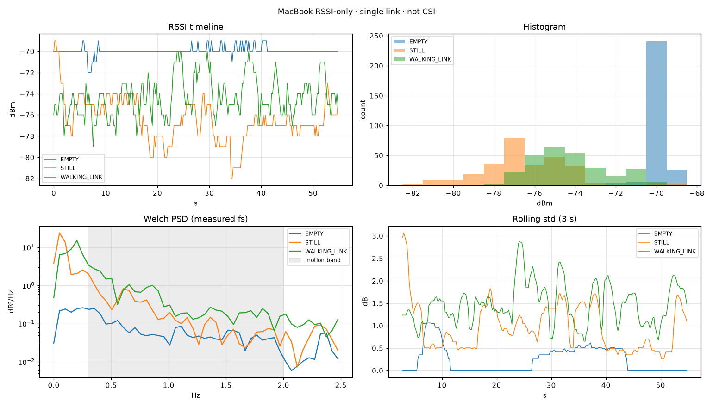

# mac-wifi-sensing

**MacBook'un dahili Wi-Fi'si ile RSSI tabanlı ortam / hareket algılama.**
Ek donanım yok: ESP32, Raspberry Pi, kamera, harici anten veya CSI kartı kullanılmıyor.
Sadece Apple Silicon bir MacBook, evdeki router ve macOS'un resmi **CoreWLAN** API'si.

> **Dürüstlük notu:** Bu bir **RSSI-only** sistemdir, CSI değildir. Tek bir Wi-Fi linkinin (router → Mac)
> toplam sinyal gücünü ölçer. **Kişi sayısı, konum, silüet, iskelet/poz veya duvar arkası görüntü üretmez.**
> Ekrandaki 3B sahne ölçülen sinyalin **şematik** gösterimidir.



---

## İçindekiler
- [Ne yapıyor, ne yapmıyor](#ne-yapıyor-ne-yapmıyor)
- [Mimari](#mimari)
- [Kurulum](#kurulum)
- [Kullanım](#kullanım)
- [Görselleştirme](#görselleştirme)
- [İlk ölçüm sonuçları](#ilk-ölçüm-sonuçları)
- [Sinyal işleme ve sınıflandırma](#sinyal-işleme-ve-sınıflandırma)
- [macOS izinleri](#macos-izinleri)
- [RuView ile ilişkisi](#ruview-ile-ilişkisi)
- [Yol haritası](#yol-haritası)

---

## Ne yapıyor, ne yapmıyor

| ✅ Yapabildikleri (deneysel) | ❌ Bu RSSI-only sistemde mümkün değil |
|---|---|
| Boş oda ↔ insan var ayrımı (link üzerinde) | Kamera benzeri görüntü |
| Hareketsiz ↔ hareketli kaba ayrımı | İnsan silüeti, iskelet, poz |
| Sinyal aktivitesi seviyesi (düşük/orta/yüksek) | Güvenilir x/y konum, takip |
| Çevredeki Wi-Fi ağları ve Bluetooth cihazlarının sinyal gücü | Cihazların **yönü** veya gerçek **mesafesi** |
| Router'a göre "fazla kayıp" tahmini (geniş belirsizlikle) | Duvar tespiti / haritalama |

Sonuçlar tek kişi, tek oda ve az sayıda kayıtla elde edildi — **deneysel olarak doğrulanması gerekiyor**.

## Mimari



**Neden Swift helper + Python (PyObjC değil)?** Swift derleyicisi Xcode CLT ile hazır geliyor, CoreWLAN'a birinci sınıf erişim veriyor,
helper bağımsız bir binary olduğu için ileride Rust/başka bir sunucuya da bağlanabilir. PyObjC'nin güncel Python sürümlerinde
CoreWLAN desteği ek risk getiriyordu.

**Neden Docker değil?** Konteyner (Linux) Mac'in Wi-Fi donanımına erişemez. Veri toplama **native** çalışmak zorunda.

Backend soyutlaması ileride yükseltme için hazır:
```
SensingBackend
├── MacRSSIBackend      ← şu an
├── WindowsRSSIBackend  ← planlı
└── ESP32CSIBackend     ← planlı
```

## Kurulum

Gereksinimler: Apple Silicon Mac (M1/M2/M3…), macOS 14+, Xcode Command Line Tools (`xcode-select --install`), Python 3.12+.

```bash
git clone https://github.com/Adonis-Lee/mac-wifi-sensing.git
cd mac-wifi-sensing
./helper/build.sh                          # CoreWLAN okuyucu + Bluetooth okuyucu (.app)
python3 -m venv .venv
.venv/bin/pip install -r requirements.txt
.venv/bin/python -m app.diagnose           # donanım kontrolü
```

Beklenen çıktı (gerçek değerler sizin cihazınızdan gelir):
```
MAC WI-FI DIAGNOSTIC
Interface: en0
RSSI:      -63 dBm
Noise:     -89 dBm
Channel:   36 (5GHz)
PHY:       802.11ax
Status:    CONNECTED
```

## Kullanım

### Canlı konsol
```bash
.venv/bin/python -m app.visual              # http://127.0.0.1:8765
.venv/bin/python -m app.visual --lan        # + ev ağındaki cihaz sayısı (sadece kendi ağınızda)
.venv/bin/python -m app.visual --router-distance 4   # + router'a göre fazla kayıp tahmini
.venv/bin/python -m app.visual --replay data/raw/<kayıt>.csv   # kaydedilmiş gerçek veriyi oynat
```

### Kalibrasyon (önemli)
Durum sınıflandırması boş oda kaydından türetilen eşiklerle çalışır. Konsolda **⚙ Ayarlar → Kalibrasyonu başlat**
(veya `python -m app.calibrate`). MacBook sabit bir yerde durmalı, geri sayımda odadan çıkın ve kayıt bitene kadar Mac'e dokunmayın.
Eşikler **hiçbir zaman elle yazılmaz**; kalibrasyon ve etiketli kayıtlardan hesaplanır.

### Komut satırı araçları
| Komut | Ne yapar |
|---|---|
| `python -m app.diagnose` | Arayüz, bağlantı, RSSI, noise, kanal kontrolü |
| `python -m app.log --hz 5 --duration 60 --label EMPTY` | Ham RSSI kaydı (`data/raw/*.csv` + `.meta.json`) |
| `python -m app.collect` | Deney toplayıcı: EXP001… numarası, kişi/sınıf/oda/mesafe/deneme bilgisi |
| `python -m app.quality <csv>` | Veri kalitesi: örnek sayısı, gerçek Hz, eksik/tekrar/sıfır, mean/std/MAD… |
| `python -m app.report a.csv b.csv …` | Karşılaştırma raporu (zaman serisi, histogram, Welch PSD, rolling std) |
| `python -m app.classifier fit …` | Kural eşiklerini etiketli kayıtlardan hesaplar |
| `python -m app.train --val S02 --test S03` | ML (LogReg/RF/SVM), **kişiden bağımsız** değerlendirme (≥3 kişi gerekir) |

## Görselleştirme

### Aktivite
Router → MacBook linki, Fresnel bölgesi tarzı halka kafes, link boyunca akan parçacıklar ve yerde aktiviteye göre dalgalanan karolar.
Link ışınının sönmesi ölçülen zayıflamayı, renkler durumu gösterir. Durum değişince tüm linki saran bir dalga yayılır.
**Karo parlaklığı konum değildir**; üstteki ikon bir **durum ikonudur**, algılanmış bir figür değildir.


### Bağlantılar
Merkezde MacBook; çevresinde bağlı router (canlı), çevredeki Wi-Fi ağları ve Bluetooth cihazları.
Yükseklik = bant katmanı (BLE / 2.4 / 5-6 GHz), **merkeze uzaklık = sinyal gücü (gerçek mesafe değil)**, **yön bilinmiyor**.
Sağ panelde tüm cihazlar sinyal gücüne göre sıralı listelenir; düğümlerin üzerine gelince detay görünür.



### Ayarlar ve kalibrasyon


## İlk ölçüm sonuçları

Ev, tek kişi, MacBook masada sabit, 5 GHz kanal 36, 5 Hz örnekleme, her durum 60 s (ilk 5 s atıldı):

| | EMPTY | STILL (link üzerinde) | WALKING (linkten geçerek) |
|---|---|---|---|
| Ortalama RSSI | −69.96 dBm | **−76.44 dBm** | **−74.30 dBm** |
| Std | 0.41 dB | 2.09 dB | 1.86 dB |
| Türev enerjisi | 0.15 | 0.50 | **1.08** |
| 3 s rolling std (medyan) | 0.00 dB | 0.86 dB | **1.46 dB** |
| 0.3–2 Hz bant gücü | 0.11 | 0.43 | **1.00** |



**Yorum:** Link üzerinde duran bir beden 5 GHz'de ~6 dB zayıflama yarattı; yürümek, durmaktan ~2 kat daha hızlı değişim üretti.
Her durumdan **tek** kayıt var, eşikler aynı kayıtlarla belirlendi (iyimser). Tekrarlanabilirlik, farklı konum/kişi ve bağımsız
boş oda kaydı ile **deneysel olarak doğrulanması gerekiyor**.

Gözlemlenen donanım sınırları: RSSI 1 dB adımlarla değişiyor ve sürücü değeri ~0.4 s'de bir güncelliyor; bu yüzden nefes gibi ince
sinyaller bu sistemde güvenilir şekilde görülemez. MacBook'un yerini/yönünü değiştirmek tek başına 9 dB oynatabiliyor.

## Sinyal işleme ve sınıflandırma

- **Özellikler (3 s pencere):** std, ortalama kayma (baseline'a göre), türev enerjisi, EMA tahmin hatası, IQR, MAD, çarpıklık,
  basıklık, CUSUM değişim noktaları, Welch PSD bant gücü, baskın frekans.
- **Frekans ekseni** her zaman zaman damgalarından **ölçülen** örnekleme hızıyla kurulur; bant sınırları Nyquist'e kırpılır.
- **Kural tabanlı durum:**
  - `ABSENT`: std ve kayma boş-oda eşiklerinin altında
  - `PRESENT_STILL`: eşik aşılmış, hızlı değişim düşük
  - `ACTIVE`: türev enerjisi hareket eşiğinin üstünde
  - 2 s çoğunluk oylamasıyla titreme bastırılır; güven = eşikten uzaklık.
- **ML:** LogReg / Random Forest / SVM; bölme **kişi bazında** (aynı kaydın parçaları asla hem eğitim hem testte olmaz).

## macOS izinleri

| Veri | İzin |
|---|---|
| RSSI, noise, kanal, PHY, tx hızı | Gerekmiyor |
| SSID / BSSID | Konum Servisleri (bilinçli olarak **istenmedi**; ağ kimliği kayıtlara yazılmıyor) |
| Bluetooth cihazları | Bluetooth izni — `bin/MacBLE.app` kendi `NSBluetoothAlwaysUsageDescription`'ı ile ister |
| Çevredeki ağ taraması | Gerekmiyor (ağlar anonim görünür) |

## RuView ile ilişkisi

[ruvnet/RuView](https://github.com/ruvnet/RuView) incelendi (bkz. [docs/RUVIEW_NOTES.md](docs/RUVIEW_NOTES.md)).
Özet: macOS helper ve özellik fikirleri faydalıydı (CUSUM, EMA residual, skew/kurtosis); ancak v2 çoklu-BSSID pipeline'ı macOS'ta
tek ölçümle çalışmıyor, `--source auto` simüle veriye düşebiliyor ve bazı eşikler sabit yazılmış. Bu proje bu noktalarda
gerçek ölçüm ve ölçülmüş örnekleme hızı ilkesini esas alır.

## Yol haritası

```
Mac RSSI (bu repo) → Windows RSSI karşılaştırması → ESP32-S3 CSI → çoklu düğüm CSI → RF ısı haritası → (kamera destekli) poz
```

- [x] M0 — CoreWLAN teşhisi
- [x] M1 — Sürekli örnekleme, ham CSV, canlı grafik
- [x] M2 — Boş/hareketsiz/yürüme deneyleri, kural tabanlı durum (ön sonuç)
- [ ] M3 — Çok kişili veri seti + kişiden bağımsız ML değerlendirmesi
- [x] M4 — Gerçek zamanlı konsol
- [ ] Windows (aynı router) ile karşılaştırmalı deney
- [ ] `ESP32CSIBackend`

## Test

```bash
.venv/bin/python -m pytest -q       # birim testleri; gerçek Wi-Fi testi bağlantı yoksa SKIPPED
```

## Lisans

MIT — bkz. [LICENSE](LICENSE).
